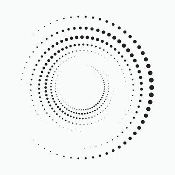

<!DOCTYPE html>
<html lang="zh-Hant">

<head>
  <meta charset="UTF-8">
  <meta name="viewport" content="width=device-width, initial-scale=1">
  <title>我的個人介紹網站</title>
  <link href="https://cdn.jsdelivr.net/npm/bootstrap@5.3.3/dist/css/bootstrap.min.css" rel="stylesheet">
  
</head>

<body>

  <!-- 導覽列 -->
  <nav id="navbar" class="navbar navbar-expand-lg navbar-dark bg-dark fixed-top">
    

      <a class="navbar-brand" href="#">我的簡介</a>
      <button class="navbar-toggler" type="button" data-bs-toggle="collapse" data-bs-target="#navContent">
        
      </button>
      

        <ul class="navbar-nav ms-auto">
          <li class="nav-item">
            <a class="nav-link" href="#about">個人介紹</a>
          </li>
          <li class="nav-item">
            <a class="nav-link" href="#education">教育背景</a>
          </li>
          <li class="nav-item">
            <a class="nav-link" href="#skills">專業技能</a>
          </li>
        </ul>
      

    

  </nav>

  <!-- 個人介紹 -->
  <section id="about" class="bg-light" style="padding-top: 100px;">
    

      <h2 class="text-center mb-4">👤 個人介紹</h2>
      

        

          

            
          

        

        

          

            我是劉冠緯，一位對資訊產業抱有期待的學生。在聯合大學主修資訊管理，熱愛唱歌和玩遊戲。 
            目前正在彌補自己過去缺失的知識，並且累積自己的底蘊和探索其他領域的興趣。 
            未來想往資訊安全與網路的方向前進，希望在做專題的這一年能夠累積更深厚的技術，讓自己在未來就職時能夠更有競爭力。 
            而我也相信努力必然會看見成效的，只要一直往前邁進、不斷學習，時間自然會記錄下你一路行走過來的軌跡。
          

        

      

    

    

      
    

  </section>

  <!-- 教育背景 -->
  <section id="education">
    

      <h2 class="text-center mb-4">🎓 教育背景</h2>
      <ul class="list-group list-group-flush">
        <li class="list-group-item">2023 - 至今：聯合大學 資訊管理系</li>
        <li class="list-group-item">2021 - 2023：新竹高商 資訊處理科</li>
      </ul>
    

    

      
    

  </section>

  <!-- 專業技能 -->
  <section id="skills" class="bg-light">
    

      <h2 class="text-center mb-4">🛠️ 專業技能</h2>
      

        

          

            

              <h5 class="card-title">網頁開發</h5>
              
熟悉 HTML、CSS，正在學習 JavaScript 與 Python。

            

          

        

        

          

            

              <h5 class="card-title">資料處理</h5>
              
會使用 Excel、SQL 進行資料清理與整理，也擅長文字編輯。

            

          

        

        

          

            

              <h5 class="card-title">團隊合作</h5>
              
有專題和小組報告經驗，擅長溝通與協作。

            

          

        

      

    

    

      
    

  </section>

 

  <!-- Bootstrap JS -->
  

  <!-- 導覽列點擊和滾動高亮功能 -->
  
</body>

</html>
